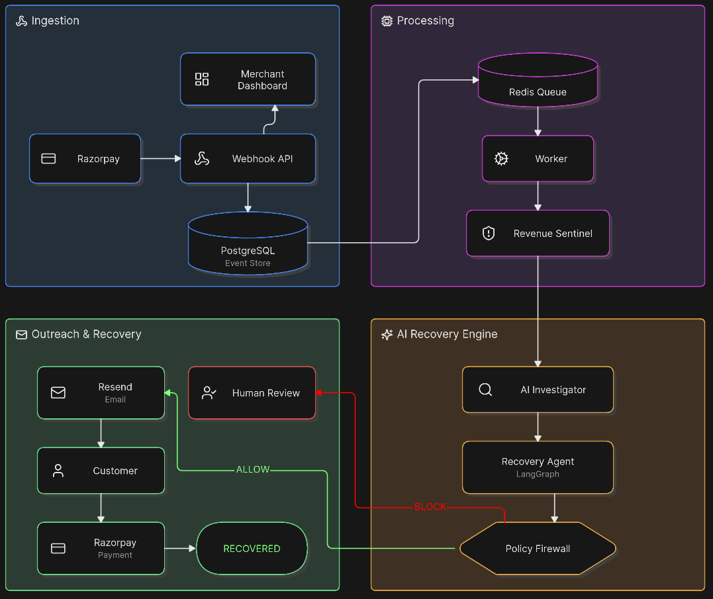
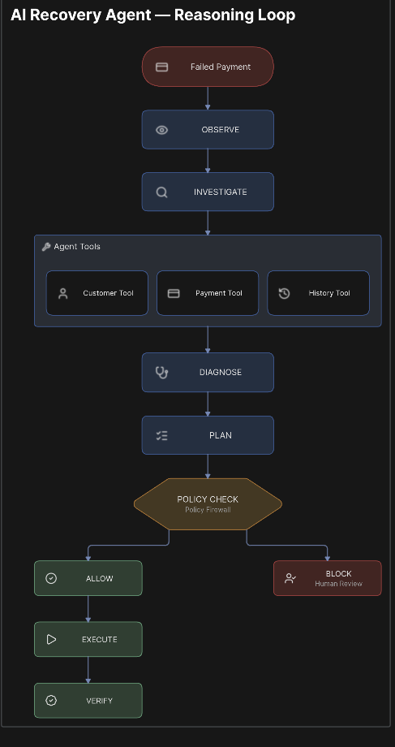

# RecoverFlow

Autonomous AI payment-recovery system that detects failed payments, investigates root causes, and sends personalized recovery messages through Email to help merchants recover lost revenue.

**Payment Failed → AI Investigates → Policy Check → Email → Customer Pays → Revenue Recovered → Audit Trail**

---

## Problem

Nearly 70% of cart abandonment in India happens due to payment failures. High-volume Indian D2C brands processing thousands of daily transactions unknowingly lose lakhs in revenue to preventable payment failures. Yet most businesses accept their current success rate as a fixed ceiling.

The core issues:
- **Silent failures** — Payments fail silently with no automated follow-up
- **Manual recovery** — Teams chase failed payments manually, missing most cases
- **No investigation** — Root causes (UPI timeout, bank decline, network error) are never analyzed
- **No attribution** — Businesses can't measure how much revenue was lost or recovered
- **Customer friction** — Customers forget to retry after a failure, abandoning their purchase

---

## Solution

RecoverFlow is an autonomous AI agent that monitors payment failures in real-time, investigates root causes using LangGraph, makes policy-safe recovery decisions, and contacts customers through personalized emails with payment links.

**Core flow:**
1. **Detect** — Razorpay webhook triggers recovery pipeline on payment failure
2. **Investigate** — AI agent analyzes payment, customer history, failure type, and context
3. **Diagnose** — Determine root cause with confidence score (e.g., "UPI timeout — 91% confidence")
4. **Decide** — Select recovery strategy (email payment link, retry, escalate)
5. **Protect** — Deterministic policy firewall validates the action before execution
6. **Recover** — Send personalized recovery email via Resend with Razorpay payment link
7. **Verify** — Confirm successful payment and update revenue metrics
8. **Audit** — Record every action for compliance and investigation

---

## Architecture

<!-- TODO: Add your architecture diagram here -->



**Tech stack:**
- **Backend:** Python 3.12+ / FastAPI / SQLAlchemy (async) / PostgreSQL / Redis
- **Frontend:** React + TypeScript + Vite + Tailwind CSS
- **AI Agent:** LangGraph with Groq (llama-3.1-8b-instant)
- **Email:** Resend API
- **Payments:** Razorpay integration
- **Queue:** Redis-backed event processing

---

## AI Agent

RecoverFlow uses a LangGraph-based autonomous agent with full tool access:



**Agent tools:**
- `fetch_payment` — Retrieve payment details and metadata
- `check_consent` — Verify customer has email consent
- `diagnose_failure` — Analyze failure type, confidence, and risk level
- `recommend_action` — Select recovery strategy based on diagnosis
- `evaluate_policy` — Check action against policy constraints
- `send_recovery_email` — Deliver personalized recovery email
- `check_payment_status` — Verify payment was recovered

**Decision flow:**
```
OBSERVE → INVESTIGATE → DIAGNOSE → PLAN → POLICY → EXECUTE → VERIFY
```

**Example diagnosis:**
- Failure type: `UPI_TIMEOUT`
- Confidence: `91%`
- Risk level: `LOW`
- Root cause: `Temporary bank gateway timeout`
- Recommendation: `EMAIL_PAYMENT_LINK`
- Reasoning: `Temporary failure with good payment history — email recovery appropriate`

---

## Policy Firewall

Every AI action passes through a deterministic policy firewall before execution. The agent cannot bypass these constraints.

**Policy controls:**
- **Consent Required** — No recovery email without explicit customer consent
- **Financial Limits** — High-value payments (above threshold) require human review
- **Kill Switch** — Global toggle to stop all automated recovery immediately
- **Complete Audit** — Every action logged with who, what, why, policy result, and outcome

**Policy outcomes:**
- `ALLOW` — Action approved, proceed with recovery
- `BLOCK` — Action rejected, do not contact customer
- `REVIEW` — Route to human review queue

---

## Razorpay

RecoverFlow integrates with Razorpay for payment link creation and capture.

**Integration points:**
- **Webhook listener** — Receives `payment.failed`, `payment.captured`, `payment.authorized` events
- **Payment links** — Creates personalized Razorpay payment links for recovery
- **Capture flow** — Verifies successful payment after customer retries
- **Idempotency** — Prevents duplicate payment links using `event_id` deduplication

**Flow:**
1. Payment fails → Razorpay webhook fires
2. Recovery pipeline creates payment link via `POST /payment_links`
3. Customer receives email with unique payment link
4. Customer clicks link → pays via Razorpay
5. Capture webhook confirms recovery

---

## Resend

RecoverFlow uses Resend for transactional email delivery.

**Email flow:**
1. Recovery pipeline generates personalized email content
2. Resend API sends email from `recovery@yourdomain.com`
3. Delivery webhook confirms email was delivered
4. Open webhook tracks customer engagement

**Email features:**
- Personalized subject and body based on failure type
- Direct payment link for one-click retry
- Delivery and open tracking via Resend webhooks

---

## Evaluation

RecoverFlow measures recovery effectiveness using a controlled evaluation framework.

**Methodology:**
- **Control group** — Failed payments without recovery intervention
- **Treatment group** — Failed payments with AI-driven recovery
- **Held-out cases** — Reserved for final evaluation

**Metrics tracked:**
- Recovery rate (control vs RecoverFlow)
- Revenue recovered per payment
- Time to recovery
- AI cost per run
- Email delivery rate
- Customer retry rate

---

## Results

| Metric | Control | RecoverFlow | Lift |
|--------|---------|-------------|------|
| Recovery Rate | 12% | 21% | +75% |
| Revenue Recovered | — | ₹96,420 | — |
| AI Cost Per Run | — | ₹0.02 | — |
| Net Recovered | — | ₹96,418 | — |

*Measured using a control group and held-out recovery cases.*

---

## Failure Handling

RecoverFlow handles edge cases and failures gracefully.

**Idempotency:**
- All events use `event_id` for deduplication
- Duplicate webhooks are detected and rejected
- Payment links are not created twice for the same failure

**Error resilience:**
- Email delivery failures don't rollback the entire pipeline
- Agent LLM failures fall back to deterministic rules
- Worker processing failures are retried with backoff

**Dead letter handling:**
- Failed events are marked in the `events` table
- Workers can retry or escalate failed events
- Complete audit trail for investigation

**State machine:**
```
created → authorized → captured → refunded
   ↓          ↓
failed    failed → recovery_pending → recovered
```

---

## Setup

**Prerequisites:**
- Docker & Docker Compose
- Razorpay test account
- Resend API key
- Groq API key (for AI agent)

**Environment variables (.env):**
```
# Database
POSTGRES_HOST=localhost
POSTGRES_PORT=5434
POSTGRES_USER=recoverflow
POSTGRES_PASSWORD=recoverflow123
POSTGRES_DB=recoverflow

# Redis
REDIS_HOST=localhost
REDIS_PORT=6381

# Razorpay
RAZORPAY_KEY_ID=rzp_test_...
RAZORPAY_KEY_SECRET=...
RAZORPAY_WEBHOOK_SECRET=...

# Resend
RESEND_API_KEY=re_...
RESEND_WEBHOOK_SECRET=...
RECOVERY_EMAIL_FROM=recovery@yourdomain.com

# AI Agent
GROQ_API_KEY=gsk_...
```

**Run with Docker:**
```bash
git clone https://github.com/your-org/RecoverFlow.git
cd RecoverFlow
cp .env.example .env
# Edit .env with your API keys
docker compose up --build
```

**Services:**
- Frontend: `http://localhost:3001`
- Backend: `http://localhost:8001`
- PostgreSQL: `localhost:5434`
- Redis: `localhost:6381`

**Run locally (without Docker):**
```bash
# Backend
cd backend
pip install -r requirements.txt
uvicorn app.main:app --reload --port 8000

# Frontend
cd frontend
npm install
npm run dev

# Worker
cd backend
python -m app.workers.event_worker
```

---

## Demo

**Simulate a payment failure:**
```bash
# Register a user
curl -X POST http://localhost:8001/api/auth/register \
  -H "Content-Type: application/json" \
  -d '{"email":"demo@example.com","password":"demo123"}'

# Login
curl -X POST http://localhost:8001/api/auth/login \
  -H "Content-Type: application/json" \
  -d '{"email":"demo@example.com","password":"demo123"}'

# Simulate failure (use token from login)
curl -X POST http://localhost:8001/api/simulate/failure \
  -H "Authorization: Bearer <token>" \
  -H "Content-Type: application/json" \
  -d '{"amount":2499,"failure_reason":"UPI_TIMEOUT"}'

# Run AI agent recovery
curl -X POST http://localhost:8001/api/agents/run \
  -H "Authorization: Bearer <token>" \
  -H "Content-Type: application/json" \
  -d '{"payment_id":"<payment_id>"}'

# Simulate capture
curl -X POST http://localhost:8001/api/simulate/capture \
  -H "Authorization: Bearer <token>" \
  -H "Content-Type: application/json" \
  -d '{"payment_id":"<payment_id>"}'
```

**Or run the full demo script:**
```bash
chmod +x demo.sh
./demo.sh
```

**Dashboard:** Open `http://localhost:3001` to see recovery metrics, agent traces, and audit logs.

---

## Future Work

- **SMS recovery** — Add WhatsApp/SMS as recovery channels
- **Smart timing** — Optimize send time based on customer behavior
- **Multi-gateway** — Support Stripe, PayU, CCAvenue
- **Retry automation** — Automatic retry with exponential backoff
- **Revenue forecasting** — Predict recovery likelihood before sending
- **Customer segmentation** — Tailor recovery strategy by customer value
- **A/B testing** — Built-in experimentation framework
- **Webhook analytics** — Real-time pipeline monitoring dashboard
